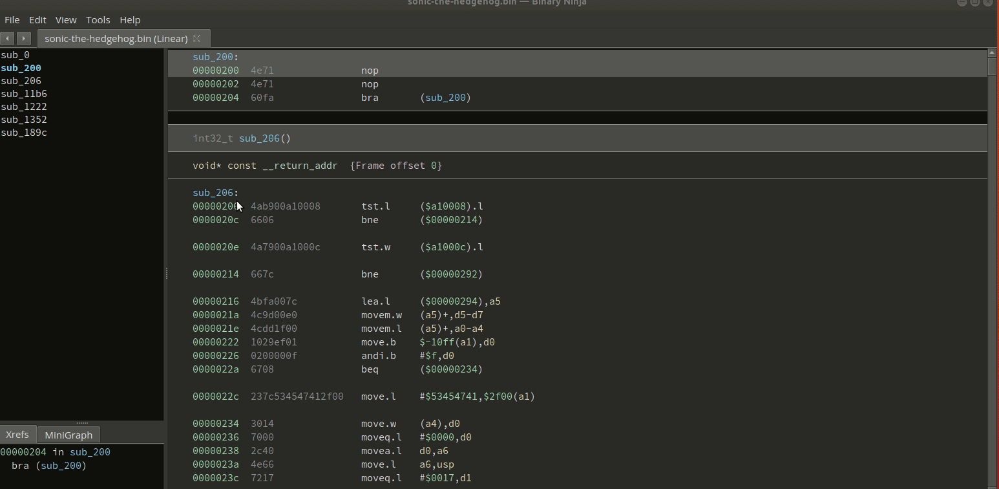

# bn-genesis

## Description

Suite of Binary Ninja plugins that assist with SEGA Genesis ROM hacking
* Load SEGA Genesis/Megadrive ROM's
* Write m68k assembly and quickly apply a patch at a specified offset
* Fixup ROM checksums
* Enumerate call tables (deprecated)
    * Vector35 addressed issues with its core and now tables are recognized by auto-analysis 

## Dependencies

* Assembler plugin requires `gcc-m68k-linux-gnu` (Ubuntu or Debian)
* Loader requires the third party m68k processor module, which can be found [here](https://github.com/wrigjl/binaryninja-m68k)
